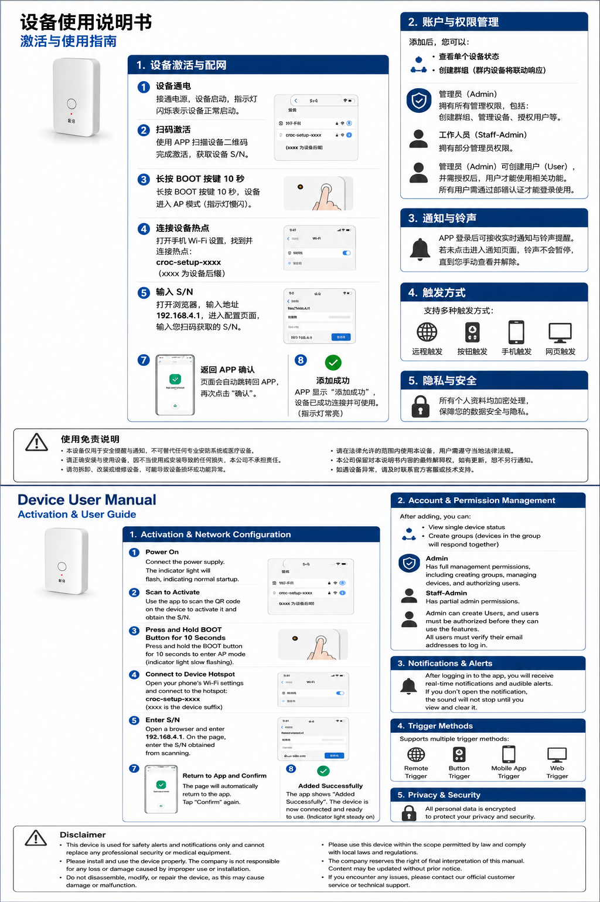

<p align="center">
  
</p>

<h1 align="center">CROC AI Systems</h1>

<p align="center">
  <strong>MAIC Nexus Challenge 2026</strong> · Public Artifact Repository<br/>
  <em>Croc Sentinel · Croc AI Orchestrator · cMax observability platform</em>
</p>

<p align="center">
  <a href="LICENSE"></a>
  
  
</p>

---

> **Important — Public Artifact Notice**  
> This repository is a **curated public artifact** for **MAIC Nexus Challenge 2026** (Artifact Link requirement).  
> **All production firmware, secrets, full API code, and commercial deployments live in private repositories** and are not published here.  
> See [`docs/MAIC_ARTIFACT_NOTICE.md`](docs/MAIC_ARTIFACT_NOTICE.md) for the public vs. private boundary.

📄 **Full submission PDF:** [`docs/MAIC-Nexus-Challenge-2026-Croc-Sentinel.pdf`](docs/MAIC-Nexus-Challenge-2026-Croc-Sentinel.pdf)

---

## Executive Summary

**Croc Sentinel** is a **mobile-first IoT security platform** built by **Croc Nexus AI Technologies** for Malaysia's public infrastructure and smart city ecosystem.

Panic buttons, motion sensors, sirens, and CCTV triggers connect to a unified cloud backend. Operators run a real-time command centre on **iOS and Android**, with every device, alarm, and site visible on a single **Interactive GIS dashboard**. Push alerts arrive within **3–30 seconds** depending on signal strength — roughly **10× faster** than traditional phone-tree systems.

Unlike enterprise systems designed for a single commercial building, Croc Sentinel supports **multi-site, multi-agency monitoring** across schools, hospitals, government buildings, and municipal CCTV networks — with role-based access control and cross-agency group sharing.

| Metric | Value |
|--------|-------|
| Alert delivery | **3–30 s** (signal-adaptive) |
| Monitoring | **24/7** continuous |
| Map scale | **100+ sites** on one dashboard |
| Mobile | **iOS + Android** native app |
| Status | **Production-ready** — real hardware, live API, deployed app |

**Target facilities:** Schools & campuses · Hospitals · Government buildings · City CCTV (DBKL) · Community centres · Public transport hubs

---

## Problem We Solve

Public facilities share one crisis: **fragmented security systems that do not communicate in real time.**

When a panic button is pressed at 11 PM in a school corridor, minutes are lost because CCTV, alarms, and sensors live on separate platforms. Phone-tree relays add **5–15 minutes** before the right responder is notified. Enterprise solutions are priced out of reach for public schools and small municipal sites.

**Croc Sentinel closes that gap** — delivering alerts to every authorised operator in **3–30 seconds**, with a full timestamped audit trail.

---

## Why Croc Sentinel

| Capability | Traditional systems | Croc Sentinel |
|------------|--------------------:|---------------|
| Alert speed | 5–15 min (phone tree) | **3–30 s** (push + live stream) |
| Multi-site GIS map | ✗ | ✓ Live alarm pins |
| Mobile command | Desktop-only | ✓ Full iOS / Android app |
| AI event intelligence | Manual monitoring | ✓ Camera AI scoring + auto phone escalation |
| Deployment cost | Enterprise pricing | ✓ Affordable public-sector IoT hardware |
| Go-live | Months to deploy | ✓ **Live today** — QR activation |

**Unique combination:** Production IoT deployment + Interactive GIS multi-site command + AI visual threat assessment + native mobile app.

---

## Solution Architecture

<p align="center">
  
</p>

| Layer | Components |
|-------|------------|
| **L1 — Edge IoT** | ESP32 controllers: panic buttons, motion sensors, sirens, relay modules. **QR activation in minutes.** |
| **L2 — Cloud API** | Secure HTTPS API, live streaming, push notification gateway, RBAC, cross-agency group sharing. |
| **L3 — Mobile App** | Native command centre: GIS map with 3D zoom, event timeline, ARM ALL / DISARM ALL, GPS patrol. |
| **L4 — AI Engine** | Visual threat scoring, smart routing, nearest-responder dispatch, automatic phone escalation. |

**Data flow**

- **Upstream:** Edge device → Cloud hub → AI classification → Live broadcast + push alerts
- **Downstream:** Mobile app → Cloud API → Device commands (arm / disarm / siren)
- **Redundancy:** Dual-channel delivery (live stream + push) — if one channel fails, the other still delivers

### Croc Platform Ecosystem (Private)

```text
┌─────────────────────────────┬──────────────────────────────────────┐
│  Croc Sentinel (Private)    │  Croc AI Orchestrator (Private)      │
│  · ESP32 global MQTT fleet  │  · 7-Agent emergency pipeline v2     │
│  · Hikvision / Dahua snaps  │  · CAO multi-model orchestration     │
│  · FCM / Email / Telegram   │  · Rules + LLM hybrid inference      │
│  · OTA · Multi-tenant RBAC  │  · Reliable queue · Outbox · SLA     │
└─────────────────────────────┴──────────────────────────────────────┘
                              │
                              ▼
                    ┌─────────────────────┐
                    │  cMax 2D/3D Platform │  Observability · Digital twin · Agent teams
                    └─────────────────────┘
```

**Croc AI Orchestrator** (private) powers Layer 4 with a self-hosted agent kernel: Risk ∥ Vision → Summary → Commander → Responder → Communication → Follow-up, plus **CAO** (Chief Agent Orchestrator) for multi-model debate, consensus, and review.

---

## Emergency Response Flow

```text
  Trigger  ──►  Cloud + AI  ──►  Alert  ──►  Respond
  Button /        Classify +       Push all        Map pin /
  sensor /        danger score     operators       GPS / disarm
  CCTV
```

| Stage | What happens |
|-------|----------------|
| **1 — Trigger** | Edge device detects panic button, motion, or siren. Message reaches cloud in milliseconds. |
| **2 — Cloud + AI** | Backend classifies event type. Camera frame captured and AI-scored. Routed to correct notification group. |
| **3 — Alert** | Live stream updates all open sessions. Push notification with deep link to background apps. |
| **4 — Respond** | Operator sees alarm pin on GIS map, reviews timeline, triggers ARM ALL, shares GPS for patrol. Full audit log recorded. |

---

## AI & Intelligent Features

```text
  Capture  ──►  Score  ──►  Notify  ──►  Call
  Camera on      AI danger    Nearest       Auto phone if
  alarm trigger  coefficient  responder     unresolved
```

| Feature | Description |
|---------|-------------|
| **Visual threat assessment** | Camera frame on alarm → AI danger score (low → critical) |
| **Autonomous decision** | Filters false alarms vs. genuine threats — reduces alert fatigue |
| **Nearest-responder dispatch** | High danger → push to nearest available operator |
| **Phone escalation** | Configurable reminder window → auto-call on-duty contact if not disarmed |
| **Smart routing** | Zone, agency, and role-based notification groups |
| **Full audit trail** | Capture → Analyse → Escalate → Follow-up → Log — every step timestamped |

**Principle: AI suggests, humans approve** — high-risk actions default to `Awaiting approval` for compliance.

### AI capability matrix (P0–P3)

| Priority | Capability | Highlights |
|----------|------------|------------|
| P0 | Event classification | Emergency / Security / Maintenance / Fault / Test |
| P0 | Risk scoring | 0–100, rules-auditable |
| P0 | Explainable reasons | Non-black-box rationale items |
| P0 | Recommended actions | Check camera → contact responder → escalate at 15 s |
| P1 | Responder recommendation | Distance, on-duty status, response history |
| P1 | Escalation prediction | No ack in 15 s → Tier-2 |
| P2 | Image analysis | Hikvision / Dahua JPEG — CV models (not LLM) |
| P3 | AI dispatcher | Who / when / which channel — approval-gated |

---

## Production Mobile App — Live Screenshots

> Real production app — not a mockup. Replaces the traditional desktop control room on mobile.

### Overview Dashboard

GIS multi-site map, site overview cards, device groups, and one-tap **ARM ALL**.

<p align="center">
  
</p>

### Event Timeline

Live-streamed chronological log with filters (Alarm / System / Network / Device). Full audit trail for municipal compliance.

<p align="center">
  
</p>

### Device Activation

Onboard new IoT devices via serial number or QR scan — no technician visit required.

<p align="center">
  
</p>

### Signals & Alarm Routing

24h / 7d alarm analytics, panic-button fan-out routing, and bulk operations log.

<p align="center">
  
</p>

---

## Edge Hardware

<p align="center">
  
</p>

ESP32 edge devices support **button, remote, mobile app, and web triggers**. Field activation via QR scan or serial number (`SN-…` / `CROC|…` payload). Wi-Fi provisioning through device hotspot (`croc-setup-xxxx` → `192.168.4.1`).

---

## About Croc Nexus AI Technologies

We build **integrated hardware + software + AI** systems:

| Focus area | Description |
|------------|-------------|
| **AI Agents & Agent Teams** | Multi-agent orchestration, CAO operating system, pluggable tools & skills |
| **Digital Twin** | Real-time mapping of devices, campuses, and event streams |
| **AI Law & Compliance** | Reviewer agents, approval frameworks, auditable decision chains |
| **cMax Work Platform** | 2D / 3D observability AI workbench for ops, orchestration, and analytics |

This public repo shows **architecture overviews and sample stubs** for Croc Sentinel and Croc AI Orchestrator — not the full private codebase.

---

## Extensibility Roadmap

The platform uses **plugin agents + tool registry + event bus** — strong horizontal extensibility without core rewrites:

| Extension | Integration path | Status |
|-----------|------------------|--------|
| **Drone patrol** | New device type + Vision Agent + geo-fence skill | Architecture reserved |
| **Embodied AI** | CAO worker + execution agent + approval gate | Architecture reserved |
| **Mobile SOS** | FCM / Twilio + Communication Agent + escalation SLA | Partially available |
| **Smart campus** | Digital twin + multi-sensor correlation | Planned |
| **AI law compliance** | Reviewer Agent + Approval Framework | CAO V3 designed |
| **cMax 3D observability** | Event stream → 2D/3D workbench rendering | Platform direction |

---

## MAIC Demo Cards

```text
┌─ AI Incident ────────────────────────┐
│ Category: Emergency    Risk: 89/100  │
│ Confidence: 92%                      │
│ Reason: Repeated · Weak signal ·     │
│         No ack · No camera image     │
│ Action: Check camera · Dispatch      │
│ Status: Awaiting approval            │
└──────────────────────────────────────┘

┌─ Responder ──────────────────────────┐
│ John Tan · 230 m · Response rate 94% │
└──────────────────────────────────────┘

┌─ Escalation ─────────────────────────┐
│ No response 15 s → Escalate Tier-2   │
│ (Twilio SMS to duty manager)         │
└──────────────────────────────────────┘
```

---

## Development Phases

| Phase | Timeline | Scope | Status |
|-------|----------|-------|--------|
| **Phase 1 · Now** | Current | IoT edge, GIS dashboard, dual-channel alerts, mobile app, AI visual threat assessment, QR activation, ARM ALL | ✅ Production (MAIC submission) |
| **Phase 2 · 2026** | 2026 | AI anomaly detection on event timelines, CCTV + sensor correlation, municipal analytics dashboard | 📋 Planned |
| **Phase 3 · 2027+** | 2027+ | Open API for emergency dispatch, Malaysia emergency services integration, nationwide municipal rollout | 📋 Planned |
| **Platform extensions** | Ongoing | Drones, embodied AI, mobile SOS, cMax 3D, AI law | Reserved in private Orchestrator |

---

## What's in This Repository

| Path | Description |
|------|-------------|
| [`docs/MAIC-Nexus-Challenge-2026-Croc-Sentinel.pdf`](docs/MAIC-Nexus-Challenge-2026-Croc-Sentinel.pdf) | Official MAIC 2026 submission (12 pages) |
| [`docs/MAIC_SUBMISSION.md`](docs/MAIC_SUBMISSION.md) | Structured submission summary |
| [`docs/ARCHITECTURE.md`](docs/ARCHITECTURE.md) | Dual-system architecture (public edition) |
| [`docs/EXTENSIBILITY.md`](docs/EXTENSIBILITY.md) | Extension scenarios & plugin guide |
| [`docs/MAIC_ARTIFACT_NOTICE.md`](docs/MAIC_ARTIFACT_NOTICE.md) | Public vs. private boundary |
| [`assets/images/`](assets/images/) | Logo, app screenshots, architecture diagram |
| [`samples/`](samples/) | Sample JSON events & telemetry |
| [`src/`](src/) | Demo stubs (not production code) |

**Not included:** Production firmware binaries, `.env` secrets, full API implementation, database migrations, Docker production stacks.

---

## Quick Sample

```bash
git clone https://github.com/<your-org>/croc-ai-systems.git
cd croc-ai-systems

pip install -r requirements.txt
python -m src.croc_orchestrator.demo_assess samples/orchestrator/alarm_event.json
```

---

## Tech Stack

| Component | Croc Sentinel | Croc AI Orchestrator |
|-----------|---------------|----------------------|
| Edge | ESP32 (Arduino / ESP-IDF) | — |
| Messaging | MQTT (Mosquitto / EMQX) | Redis queue + Outbox |
| Backend | FastAPI + SQLite / PostgreSQL | FastAPI + PostgreSQL |
| AI | Cloud visual + Qwen dual-model (roadmap) | Self-hosted CAO + hybrid inference |
| Deploy | Docker Compose | Docker Compose + Nginx HA |
| Observability | cMax 2D/3D workbench | Prometheus + OpenTelemetry |

---

## Team & Contact

| Role | Expertise |
|------|-----------|
| IoT Engineering | Edge firmware, sensor integration, QR activation |
| Cloud Development | Live streaming, push gateway, multi-tenant auth |
| Mobile App Design | Interactive GIS, push notifications, responsive UI |
| AI Integration | Visual threat scoring, smart routing, auto-call |
| Public Safety | Schools, hospitals, government, CCTV deployments |
| Smart City | Multi-agency coordination, municipal scale |

| | |
|--|--|
| **Company** | Croc Nexus AI Technologies |
| **Email** | partnerships@crocnexus.com |
| **Phone** | +084-349525 |
| **Artifact** | This public repo is for MAIC review; core development is private |

---

## License

This public artifact repository is released under the [MIT License](LICENSE).  
Private production code and firmware are governed by internal licensing policies.

---

*Version 2026-06-19 · Public Artifact · Private implementation is the source of truth*
