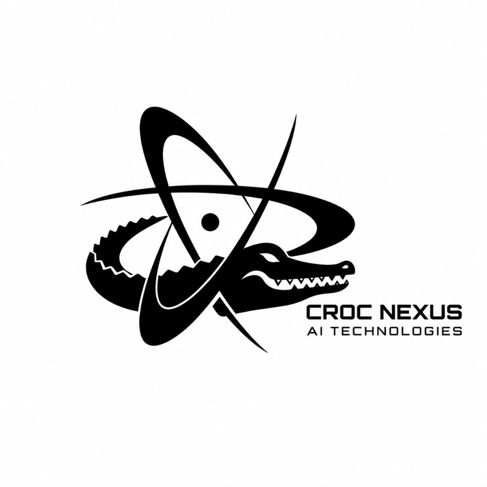
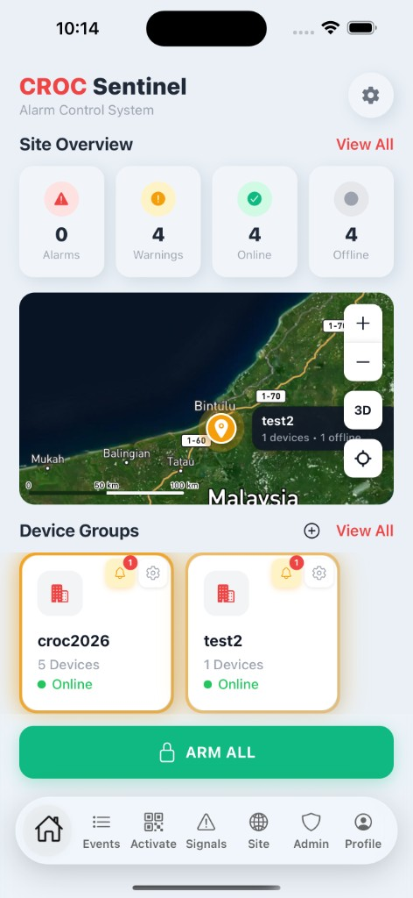
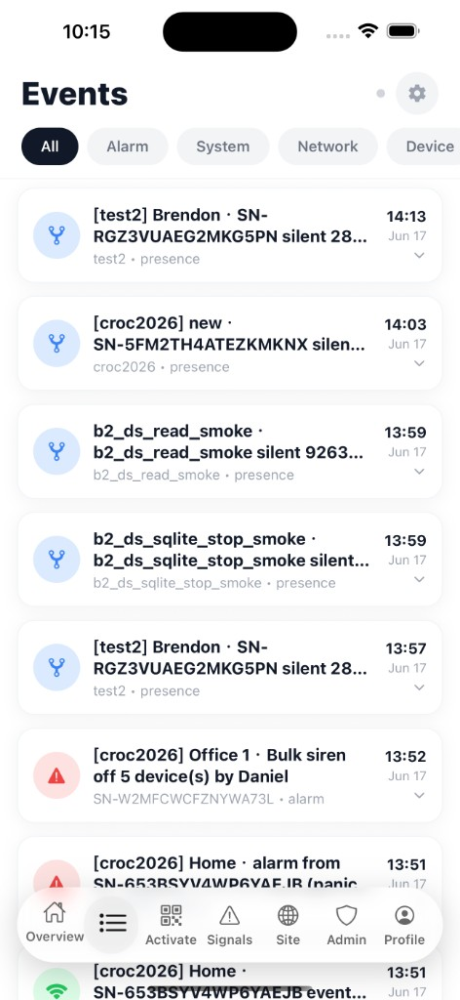
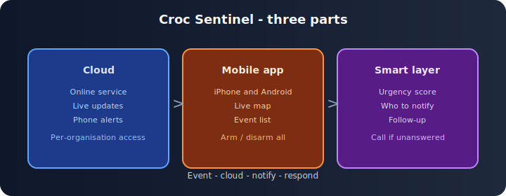
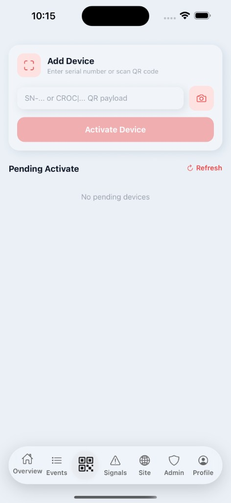
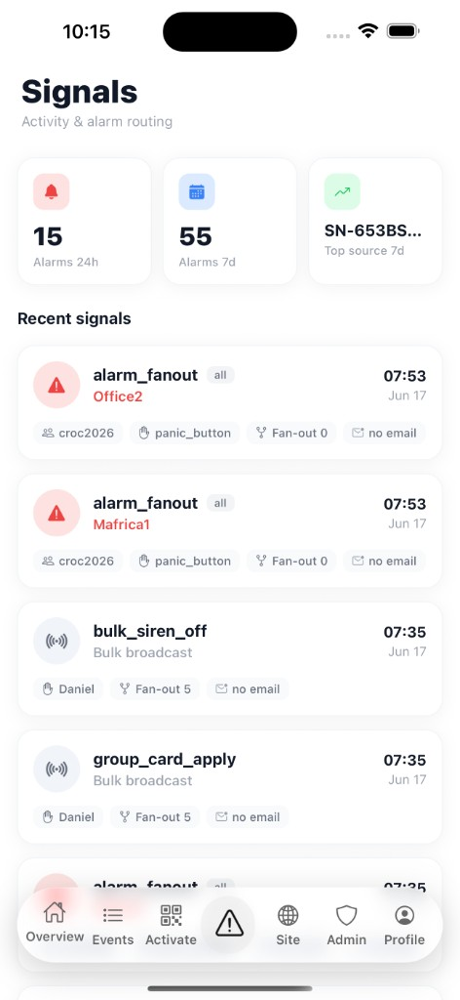

<p align="center">
  
</p>

<h1 align="center">Croc Nexus AI Technologies</h1>

<p align="center">
  <strong>AI-native site safety — built in Malaysia, owned end to end</strong>
</p>

<p align="center">
  <a href="LICENSE"></a>
  
  
  
</p>

<p align="center">
  <a href="#story">Our story</a> ·
  <a href="#products">Products</a> ·
  <a href="#sentinel">Sentinel</a> ·
  <a href="#orchestrator">Orchestrator</a> ·
  <a href="#scenes">Scenes</a> ·
  <a href="#repository">Repository</a> ·
  <a href="#contact">Contact</a>
</p>

<br/>

> **Two founders. One stack.** We build AI that **scores urgency**, **calls the right person**, and **logs every step** — for real sites, not slide decks.  
> **Site requirement:** working network (Wi‑Fi or wired) at each location.

<br/>

---

<h2 id="story">Our story</h2>

**Croc Nexus AI Technologies** is a **two-person AI startup based in Malaysia**.

We started after seeing the same failure mode everywhere: a site alarm fires, everyone gets the same ping, nobody knows how serious it is, and response depends on whoever happens to see their phone first. Camera footage sits unused. If the first person does not answer, the chain quietly breaks.

We are not a legacy hardware company adding an AI sticker. We wrote our own **cloud, mobile apps, and orchestration** because we wanted every alert to carry a **score**, a **named contact**, and an **audit trail** — with safety rules that always run first and humans still in control.

Being small keeps us close to the problem: we configure each deployment ourselves, iterate quickly, and keep the full product **under the Croc Nexus name** — no white-label, no rebranded apps for others.

---

<h2 id="products">Our products</h2>

| Product | Role | Status |
|:--------|:-----|:-------|
| **[Croc Sentinel Systems](#sentinel)** | Site monitoring — map, devices, alerts, mobile apps | **In production** |
| **[Croc AI Orchestrator](#orchestrator)** | AI coordination — urgency, routing, escalation, audit | **In production** |

Both run on **Croc Nexus–owned** infrastructure. They work together: **Sentinel sees the event, Orchestrator decides and drives response.**

---

<h2 id="sentinel">Croc Sentinel Systems</h2>

**AI-powered monitoring for connected sites.**

<p align="center">
  
  &nbsp;&nbsp;
  
</p>

- Event recognition on the map  
- **3–30 second** alerts to phones  
- Linked camera context when available  
- iPhone & Android apps — map, timeline, setup, activity  
- **Croc Nexus apps only** — configured per site, not customer-branded  

---

<h2 id="orchestrator">Croc AI Orchestrator</h2>

**AI that turns alerts into action** — paired with Sentinel on every deployment.

| Capability | What it does |
|:-----------|:-------------|
| **Score** | Urgency **0–100** with plain-language reasons |
| **Summarise** | Short text for operators — not raw telemetry |
| **Route** | **Phone call + app alert** to admin or assigned agent |
| **Escalate** | Next contact if nobody answers |
| **Approve** | Sensitive steps wait for a human |
| **Audit** | Every AI and human step timestamped |

**Rules always run first.** AI adds detail; it does not silently lower urgency. If smart services are unavailable, rule-based handling continues.

```text
  Sentinel detects event
       │
       ▼
  Orchestrator scores + routes
       │
       ├── Call + app alert
       └── Audit log
       │
       ▼
  Person checks on site
```

This repository includes a **minimal sample** of orchestration logic — not production source. See [Repository](#repository).

---

<h2 id="how-ai-helps">How AI changes response</h2>

| Before | With Croc Nexus |
|:-------|:----------------|
| Every alarm feels equally urgent | **Scored urgency** with readable reasons |
| Staff wait and guess | AI **calls admin or agent** to go check |
| Wrong person gets pinged | AI **routes by role, zone, availability** |
| Chain breaks if no answer | **Auto-escalation** + full **audit log** |

**Honest today:** people still **go to the site to check**. Our AI makes that faster and clearer — we do not claim full autonomy on the ground yet.

---

<h2 id="scenes">Where we deploy</h2>

Government buildings · malls · hospitals · plazas · parks · roads · traffic junctions · commercial districts · campuses · residential communities

Per-site **rules, call lists, and escalation** on our platform. New scene types scoped per project.

<p align="center">
  
</p>

---

<h2 id="repository">This repository</h2>

Public overview, docs, and **small samples** for Croc Nexus products — **not** production cloud code, models, or integration secrets.

```bash
git clone https://github.com/DD-111/CROC-AI-SYSTEMS.git
cd CROC-AI-SYSTEMS
python -m src.croc_orchestrator.demo_assess samples/orchestrator/alarm_event.json
```

| Folder | Contents |
|:-------|:---------|
| [`docs/`](docs/) | [Architecture](docs/ARCHITECTURE.md) · [Products](docs/PRODUCT_OVERVIEW.md) · [Orchestrator (brief)](docs/ORCHESTRATOR.md) · [Extensibility](docs/EXTENSIBILITY.md) |
| [`assets/`](assets/) | Logo and app imagery |
| [`samples/`](samples/) | Example event data |
| [`src/`](src/) | Minimal orchestration sample + [edge sketch](src/croc_orchestrator/coordination_edge.py) |

See [LICENSE](LICENSE) for scope.

<p align="center">
  
  &nbsp;&nbsp;
  
</p>

---

<h2 id="contact">Contact</h2>

**Croc Nexus AI Technologies** · Malaysia  
partnerships@crocnexus.com · +084-349525

---

<p align="center">
  <strong>Croc Nexus AI Technologies</strong><br/>
  Croc Sentinel Systems · Croc AI Orchestrator<br/>
  partnerships@crocnexus.com · +084-349525<br/>
  <sub>© Croc Nexus AI Technologies · <a href="LICENSE">MIT License</a> (repo materials only)</sub>
</p>
