<p align="center">
  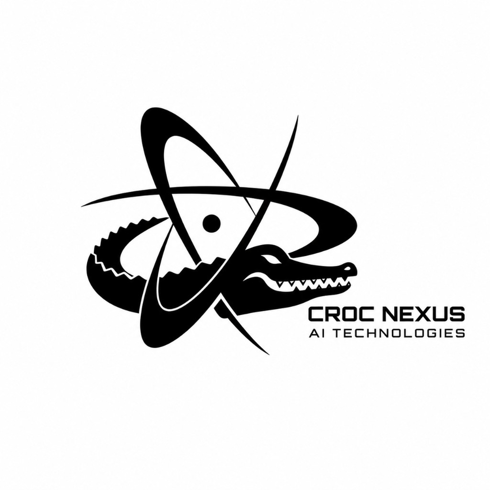
</p>

<p align="center">
  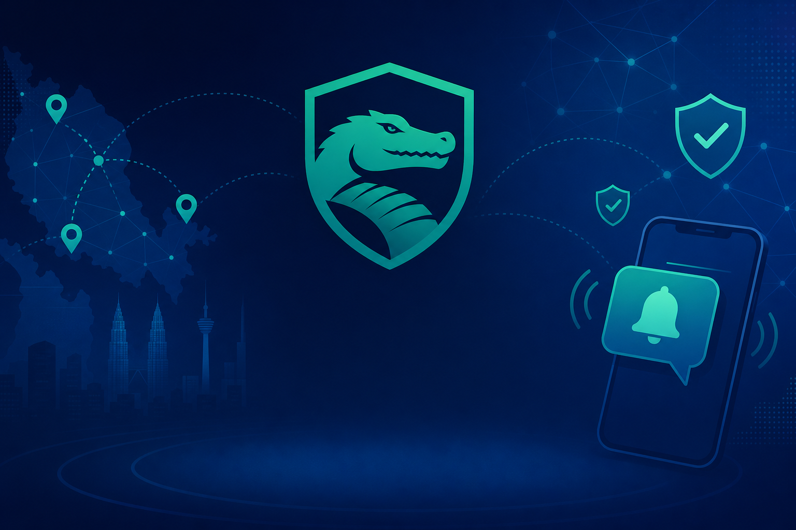
</p>

<h1 align="center">Croc Sentinel</h1>

<p align="center">
  <strong>The smart decision layer for the security systems you already have.</strong><br/>
  <sub>It doesn't replace your cameras and alarms — it runs the <em>whole response</em>:<br/>get ready · respond together · prove what happened.</sub><br/>
  <sub>By Croc Nexus AI Technologies · a two-person startup from Malaysia</sub>
</p>

<p align="center">
  <a href="LICENSE"></a>
  
  
  
  
</p>

<p align="center">
  <a href="#what">What is Sentinel</a> ·
  <a href="#journey">The full journey</a> ·
  <a href="#problem">The Problem</a> ·
  <a href="#why">Why Sentinel</a> ·
  <a href="#when">When it happens</a>
</p>
<p align="center">
  <a href="#watch">Watch the demo</a> ·
  <a href="#before">Before</a> ·
  <a href="#during">During</a> ·
  <a href="#drones">Drones</a> ·
  <a href="#after">After</a> ·
  <a href="#command-center">Command Center</a> ·
  <a href="#mobile">Mobile App</a> ·
  <a href="#roadmap">Roadmap</a> ·
  <a href="#faq">FAQ</a> ·
  <a href="#contact">Contact</a>
</p>

<br/>

<p align="center">
  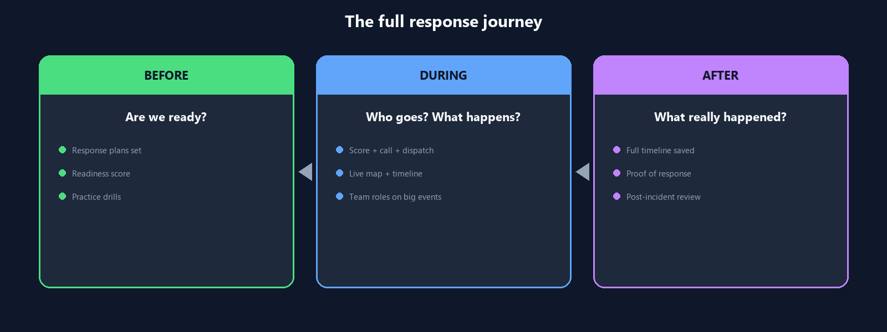
</p>

<p align="center"><sub>Most alarms stop at the beep. Sentinel runs the <strong>whole loop</strong>: get ready → respond together → prove what happened.</sub></p>

---

<h2 id="watch">Watch the demo</h2>

<p align="center">
  <strong>Cinematic ops demo — glass console · map routes · live video · voice · auto RTH</strong>
</p>

<p align="center">
  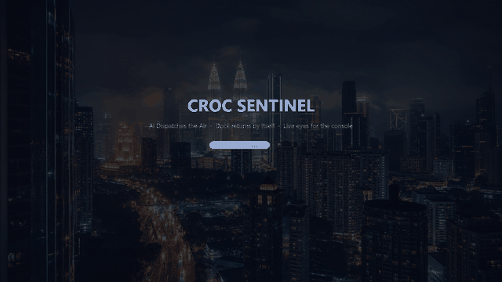
</p>

<p align="center">
  <a href="assets/video/sentinel-cinematic-drone-ops.mp4"><strong>▶ Download cinematic MP4 (~30s, 1080p)</strong></a>
  &nbsp;·&nbsp;
  <a href="assets/video/sentinel-drone-response-demo.mp4">Earlier step-card MP4</a>
</p>

<p align="center">
  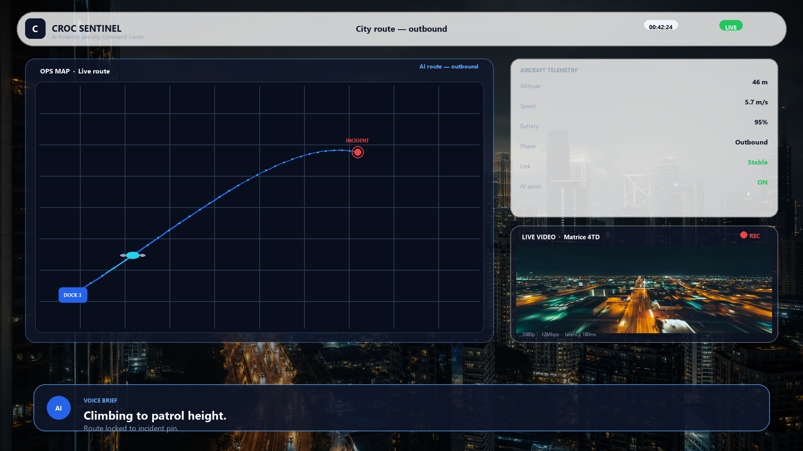
</p>

What this film-style demo shows:

1. **Command Center glass UI** — styled like the live console
2. **AI dispatch** — Dock 3 unlock, Matrice 4TD takeoff after human OK
3. **Map flight path** — outbound route to the incident pin
4. **Live video return** — FPV panel on the console in real time
5. **Voice briefs** — AI speaks status to responders on the channel
6. **Auto return (RTH)** — aircraft flies home and nests for charge by itself
7. **Proof** — mission closes onto the incident timeline

Hardware packages (estimate): **Dock 3 RM 55,140** · **Matrice 4D RM 18,180** · **Matrice 4TD RM 25,740**

---

<h2 id="what">What is Sentinel</h2>

Almost every building already has cameras and alarms. They're good at one thing — **noticing** that something happened.

But that's only half the story.

When something goes wrong, three questions always come up:

1. **How bad is it?**
2. **Who should go — and what should they do?**
3. **Can we prove what we did afterwards?**

Ordinary systems can't answer any of these. They beep, send a notification, and leave the rest to luck.

**Croc Sentinel is not another alarm.** It's the **full response system** that sits on top of what you already have — from getting ready before anything happens, to coordinating people during an event, to keeping an honest record when it's over.

Your cameras keep watching. Your alarms keep ringing. Sentinel is the calm, tireless layer on top that turns noise into a **clear, tracked, accountable response.**

> **Status:** early / trial stage. It runs on real sites today. A real person still goes to check — Sentinel makes sure the right person knows fast, knows why, and every step is saved.

---

<h2 id="journey">The Full Response Journey</h2>

Most security products stop at the beep. Croc Sentinel runs three phases — like an operating system for how your site responds:

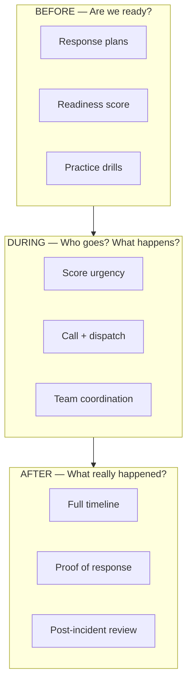
```mermaid
flowchart TB
    subgraph BEFORE["BEFORE — Are we ready?"]
        B1["Response plans"]
        B2["Readiness score"]
        B3["Practice drills"]
    end
    subgraph DURING["DURING — Who goes? What happens?"]
        D1["Score urgency"]
        D2["Call + dispatch"]
        D3["Team coordination"]
    end
    subgraph AFTER["AFTER — What really happened?"]
        A1["Full timeline"]
        A2["Proof of response"]
        A3["Post-incident review"]
    end
    BEFORE --> DURING --> AFTER
```

| Phase | Plain question | What Sentinel does |
|:------|:---------------|:-------------------|
| **Before** | *Are we ready?* | Set response plans, check readiness score, run practice drills |
| **During** | *Who goes? What happens?* | Score urgency, call the right people, send the nearest, organise a team for big events |
| **After** | *What really happened?* | Save the full timeline, bundle proof of response, write a post-incident review |

This is the heart of what we built. Not louder sirens — a **complete loop** from preparation to proof.

<p align="center">
  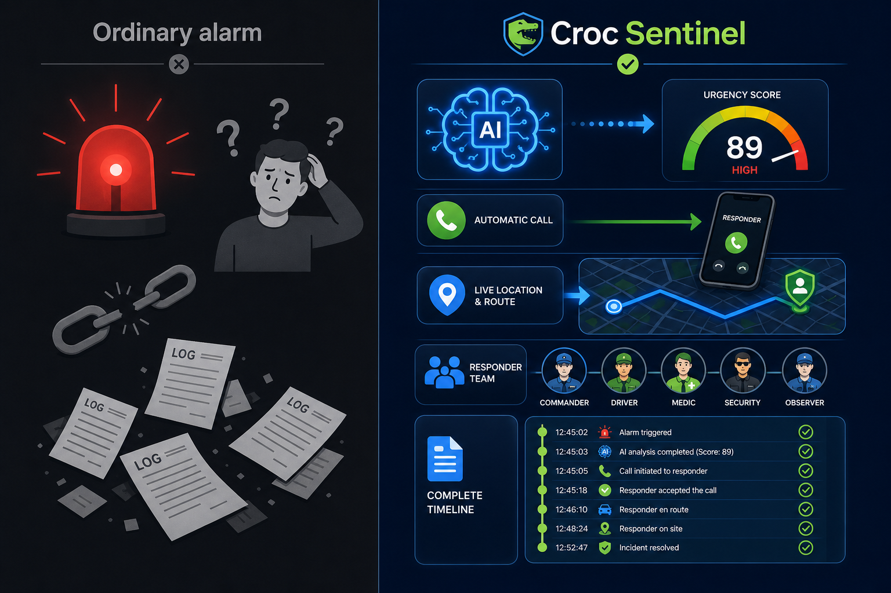
</p>

<p align="center">
  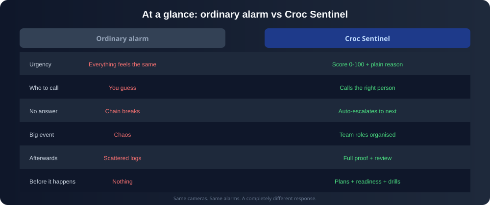
</p>

---

<h2 id="problem">The Problem</h2>

**Detecting is the easy part. Responding is the hard part** — and it's where the real losses happen.

Cameras and alarms are everywhere and cheap. But when an alarm goes off today, this is what usually happens:

- **Everything feels equally urgent.** A door left open sounds the same as a real emergency.
- **Nobody knows how serious it is.** Someone has to stop and guess.
- **Nobody knows who should go.** People wait, or the wrong person gets bothered.
- **If the first person misses the call, the chain breaks.** Nothing moves until someone happens to notice.
- **There's no clear record.** Afterwards, no one can say who did what, or when.

The result: slow response, constant noise, and no one clearly responsible.

---

<h2 id="philosophy">Our Philosophy</h2>

We believe in a simple idea: **the machine should do the first round of thinking, and a person should make the final call.**

Three rules guide everything we build:

1. **Safety first, always.** The system can make something *more* urgent, but it can **never quietly make it less** urgent.
2. **People stay in charge.** The system suggests and prepares; a human approves anything that matters.
3. **Nothing hides.** Every decision — by the machine or the person — is written down in plain words.

We are not trying to replace people. We are trying to make sure the right person acts **fast, and for the right reason.**

---

<h2 id="fail">Why Existing Systems Fall Short</h2>

To be clear: cameras, alarms, and recording systems are **not bad** — they do their job well. They see, they ring, they record. The problem is that everything *after* that — the thinking — still lands on a person.

That's where it breaks down in real life:

- A person watching ten screens **can't rank** what matters.
- At 3 a.m., tired staff **miss or misjudge** alerts.
- When the first contact doesn't answer, **there's no plan B.**
- After an incident, there's **no honest trail** of what actually happened.

Adding more cameras or louder sirens doesn't fix any of this — it just adds more noise for the same tired person to sort through. The missing piece was never more equipment. It was a **brain on top** that understands, decides, coordinates, and keeps track.

**That's the gap Sentinel fills — without asking you to throw anything away.**

---

<h2 id="why">Why Sentinel</h2>

Sentinel sits **on top of** what you already own and adds four things your current setup can't do on its own:

| | The layer Sentinel adds |
|:--|:--|
| **Understand** | Reads each event and works out what it actually is |
| **Decide** | Scores how urgent it is, with a plain-language reason |
| **Coordinate** | Calls the right person, then the next if no one answers |
| **Track** | Keeps a simple, honest record of every step |

| The usual way | With Croc Sentinel on top |
|:--------------|:--------------------------|
| Every alarm sounds the same | Each one gets a **score** and a **plain reason** |
| People guess how urgent it is | The system suggests, a person confirms |
| Someone must figure out who to call | It **calls the right person automatically** |
| If no one answers, it stops | It **moves to the next person** |
| No clear record afterwards | It **keeps a simple record of everything** |

Because it's a layer — not a replacement — you keep your cameras, your alarms, and your investment. You just give them a brain.

**It all runs as one closed loop:**

```text
  Score  →  Call  →  Follow the right steps  →  Send the nearest person  →  Coordinate  →  Keep a record
```

That full loop — not just the first "ding" — is what actually gets someone to the scene, on time, with a plan.

---

<h2 id="when">When Something Goes Wrong</h2>

<p align="center">
  <strong>Watch the full flow — 9 steps, start to finish</strong>
</p>

<p align="center">
  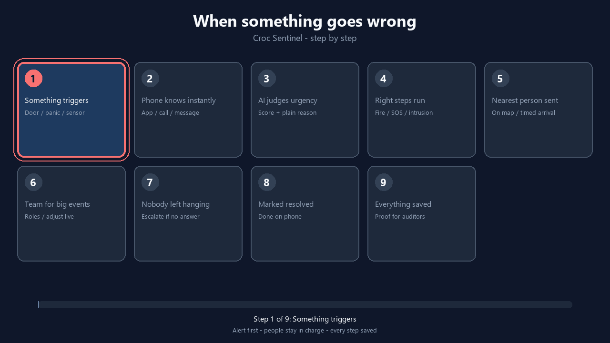
</p>

<p align="center">
  <a href="assets/video/incident-flow-demo.mp4">▶ Download MP4 version</a>
  &nbsp;·&nbsp;
  <a href="assets/images/incident-flow.svg">View static flow diagram</a>
</p>

<p align="center">
  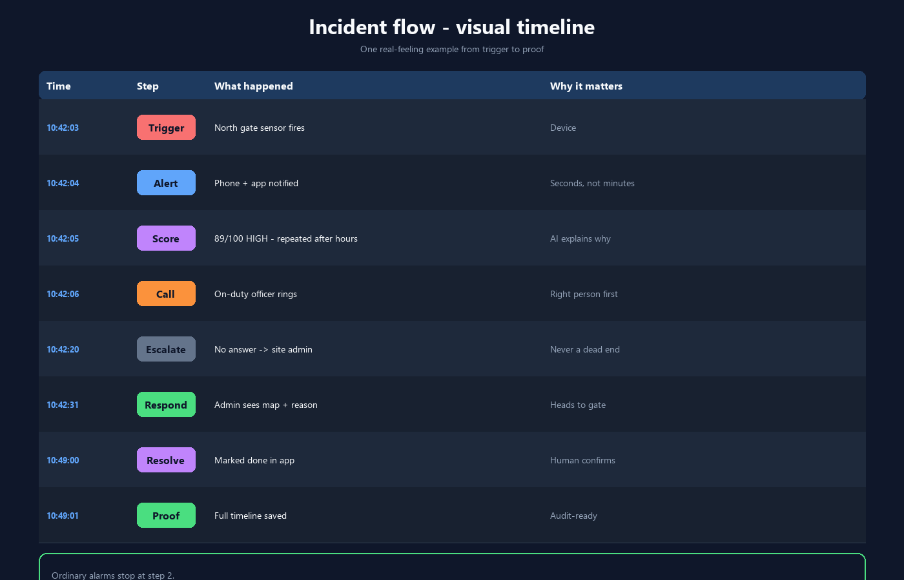
</p>

Here's the same story as a timeline — the kind you'd see in the app:

```text
  10:42:03   A sensor at the north gate triggers.
  10:42:04   Your phone gets the alert — within seconds, not minutes.
  10:42:05   Sentinel scores it 89 / 100 — "high."
             Reason: "Repeated triggers at north gate after hours."
  10:42:06   It calls the on-duty officer and pings the app.
  10:42:20   No answer. It automatically calls the backup — the site admin.
  10:42:31   Admin answers, sees the map and reason, heads to the gate.
  10:49:00   Admin marks it resolved in the app.
             Every step above is saved, with the exact time.
```

No guessing. No "who was supposed to handle this?" Just a clear, recorded response.

**For a bigger event** — say a fire or a break-in — one person isn't enough. Sentinel can organise several responders into clear roles (one to check, one to watch the perimeter, one to record, one to coordinate), picking the nearest and best-suited for each, and adjusting as things change. That kind of **team coordination** is the part ordinary alarm systems simply don't do.

---

<h2 id="before">Before — Are You Ready?</h2>

Good response doesn't start when the alarm rings. It starts **before anything happens.**

<p align="center">
  
</p>

| What you set up | Why it matters |
|:----------------|:---------------|
| **Response plans** | Pre-written steps for fire, SOS, intrusion — so nobody improvises at 3 a.m. |
| **Readiness score** | A simple number that shows gaps: missing contacts, untested devices, outdated plans |
| **Practice drills** | Run a fake event and see how your team would respond — without waking anyone up |

Think of it like a fire drill, but for your whole digital response chain. When the real thing happens, your team already knows the steps.

---

<h2 id="during">During — Who Does What?</h2>

When something actually happens, everyone needs to see the same picture — and know their job.

<p align="center">
  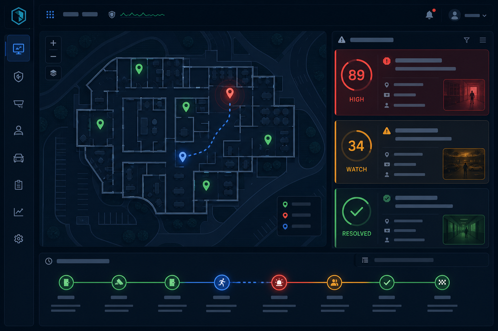
</p>

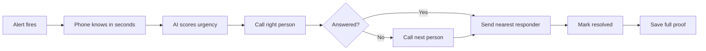
```mermaid
flowchart LR
    A["Alert fires"] --> B["Phone knows in seconds"]
    B --> C["AI scores urgency"]
    C --> D["Call right person"]
    D --> E{"Answered?"}
    E -->|No| F["Call next person"]
    E -->|Yes| G["Send nearest responder"]
    F --> G
    G --> H["Mark resolved"]
    H --> I["Save full proof"]
```

**On the big screen (Command Center):**
- Live map of every device and active event
- Incidents sorted by urgency — serious ones rise to the top
- A timeline of what the system did and what people decided
- One tap to take over or confirm any step

**On the incident page (one event, full detail):**
- How urgent it is, and why — in plain words
- Who was called, who answered, who was sent
- Countdown clocks if nobody responds in time
- A person in charge can be assigned, or hand off to someone else

**On the responder's phone:**
- "You have a job" — accept, go, mark arrived, mark done
- Live map showing where to go
- Deep link straight from a push notification or phone call

**For big events — team coordination:**
Several people get clear roles at once. The system picks who's nearest and best suited, and adjusts as the situation changes. This is built and tested — we turn it on per site as we roll out.

---

<h2 id="drones">Drones — Eyes in the Air</h2>

Sentinel can send **people on the ground and aircraft from a dock** as one response — AI suggests, a person confirms.

<p align="center">
  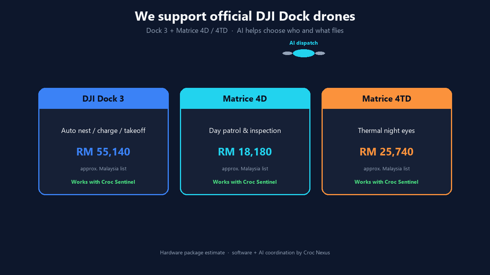
</p>

### Hardware we support (estimate, Malaysia)

| Package | What it's for | Approx. price |
|:--------|:--------------|:--------------|
| **DJI Dock 3** | Auto nest · charge · takeoff | **RM 55,140** |
| **Matrice 4D** | Day patrol & inspection | **RM 18,180** |
| **Matrice 4TD** | Thermal / night eyes | **RM 25,740** |

Prices are approximate hardware list figures. Software, setup, and AI coordination are provided by **Croc Nexus**.

### What AI helps with

- Pick the **nearest ready dock** when an incident is serious
- Choose **4D for daytime** or **4TD when heat / night eyes help**
- Keep **city patrol routes** running, then divert to a live event
- Stream **live video** back to the command center
- Speak **voice briefs** on the response channel
- Run **auto return (RTH)** — fly home and nest for charge by itself
- Always leave the final **fly / don't fly** decision to a person

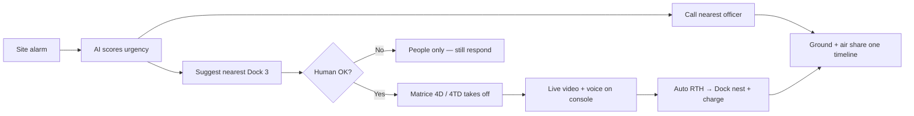
```mermaid
flowchart LR
    A["Site alarm"] --> B["AI scores urgency"]
    B --> C["Call nearest officer"]
    B --> D["Suggest nearest Dock 3"]
    D --> E{"Human OK?"}
    E -->|Yes| F["Matrice 4D / 4TD takes off"]
    F --> G["Live video + voice on console"]
    G --> H["Auto RTH → Dock nest + charge"]
    E -->|No| I["People only — still respond"]
    C --> J["Ground + air share one timeline"]
    H --> J
```

<p align="center">
  <a href="assets/video/sentinel-cinematic-drone-ops.mp4">▶ Watch the cinematic ops film</a>
</p>

---

<h2 id="after">After — Proof & Learning</h2>

When it's over, you shouldn't have to piece together what happened from memory or scattered logs.

<p align="center">
  
</p>

| What you get | What it's for |
|:-------------|:--------------|
| **Full timeline** | Every trigger, call, dispatch, and human action — with exact times |
| **Proof of response** | A read-only bundle you can show managers, insurers, or auditors |
| **Post-incident review** | A short write-up: what went well, what to improve next time |
| **Exportable audit log** | Download history to CSV or PDF when you need it |

This isn't just "we have logs somewhere." It's a **complete, honest story** of what your site did — ready when someone asks.

---

<h2 id="where">Where It Works</h2>

Croc Sentinel is useful anywhere people need to respond to real events:

<p align="center">

| | | |
|:-:|:-:|:-:|
| Government buildings | Shopping malls | Hospitals & clinics |
| Plazas & squares | Parks | Roads & streets |
| Traffic junctions | Commercial districts | Campuses & industrial parks |
| Housing communities | *(Homes — in development, not open yet)* | |

</p>

For each place, we set up its own rules — who to call, when, and how urgent different events should be.

---

<h2 id="architecture">System Architecture</h2>

Sentinel is designed as a **layer that sits on top of your existing security systems** — not a rip-and-replace.

```text
   Your existing systems  ──►   CROC SENTINEL  ──►   The right person
   (cameras, alarms,            (the smart layer:     (phone + app,
    sensors, recorders)          understand, decide,   with a record)
                                 coordinate, track)
```

The smart layer itself has three simple parts working together:

<p align="center">
  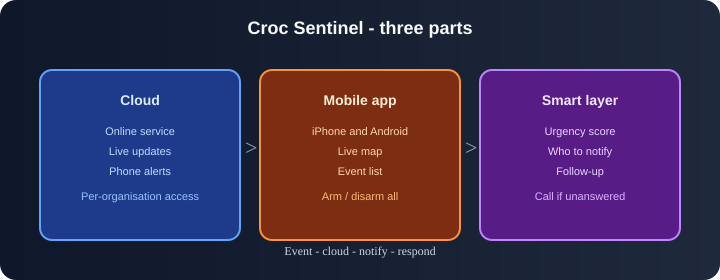
</p>

| Part | In plain words |
|:-----|:---------------|
| **The cloud** | The always-on service that receives events and does the thinking |
| **The app** | What people see — the map, the alerts, the buttons — on iPhone and Android |
| **The AI brain** | The helper that scores urgency, picks who to call, and follows up |

Behind the scenes, the brain (we call it **Croc AI Orchestrator**) works like a small team where each helper has one job — one reads the event, one decides urgency, one picks who to call, one follows up. It runs on our own cloud, and everything stays under the Croc Nexus name.

> We connect to your existing equipment **per project** — what fits is agreed up front. As an early-stage team, we're honest about scope rather than claiming we plug into everything on day one.

---

<h2 id="how">How It Works — Five Things the AI Does</h2>

```text
  Your camera / alarm / sensor notices something
          │
          ▼
  Your phone knows within seconds (alert never waits for AI)
          │
          ▼
  Sentinel scores how urgent — with a one-line reason
          │
          ├──►  Calls + app alert to the right person
          ├──►  Runs the right response plan for this event type
          └──►  Saves a record of every step
          │
          ▼
  A real person goes to check
          │
          ▼
  Resolved — or passed to the next person if still open
```

1. **Understands** the event — emergency, security, or maintenance?
2. **Scores** how urgent it is, with a one-line reason anyone can read.
3. **Chooses** who to call, based on role, area, and who's on duty.
4. **Follows up** on its own if no one answers — and sends the nearest person when it's serious.
5. **Records** everything, with exact times — for proof afterwards.

---

<h2 id="use">How To Use</h2>

**For a real site**, we set it up for you — the rules, the call list, response plans, and who gets notified are all configured for your specific place. Everything runs through **our own app**; we don't put your logo on someone else's software.

**To see the idea yourself**, this page includes a tiny demo. It takes a made-up alarm and prints a score and a short summary:

```bash
git clone https://github.com/DD-111/CROC-AI-SYSTEMS.git
cd CROC-AI-SYSTEMS
python -m src.croc_orchestrator.demo_assess samples/orchestrator/alarm_event.json
```

> This demo is just for illustration. The real system and app stay private.

---

<h2 id="command-center">Command Center</h2>

The command center is the **big-screen view** for managers and control rooms — live map, every active event, urgency at a glance.

<p align="center">
  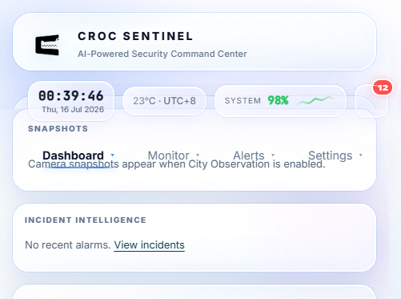
</p>

<p align="center"><sub>Real command center from our operations console.</sub></p>

<p align="center">
  
</p>

- See every site and event on one map
- Sort by urgency automatically — the serious ones rise to the top
- Watch a live timeline of what the AI did and what people decided
- Take over or confirm any step yourself
- Dispatch the nearest responder with one action

---

<h2 id="mobile">Mobile App</h2>

<p align="center">
  
</p>

<p align="center">
  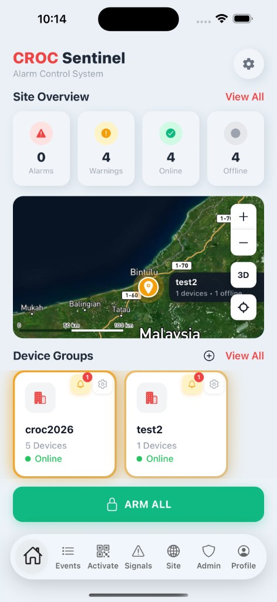
  &nbsp;
  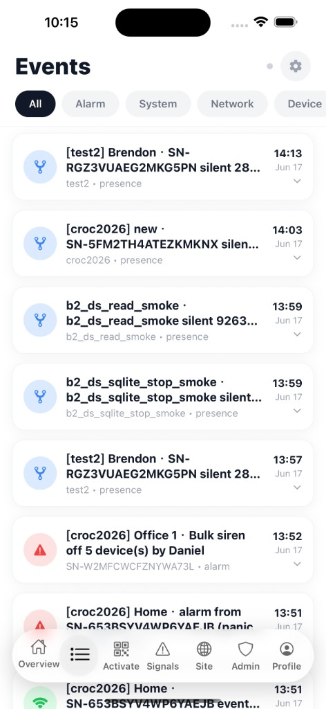
  &nbsp;
  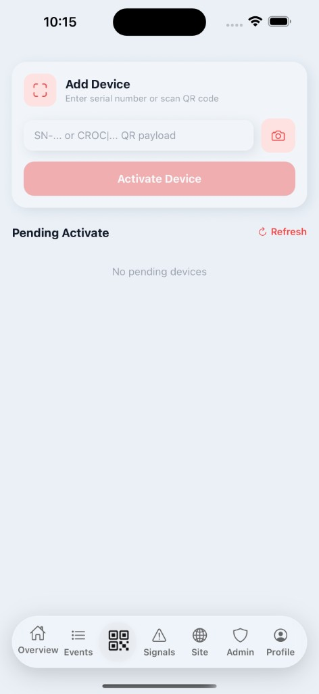
  &nbsp;
  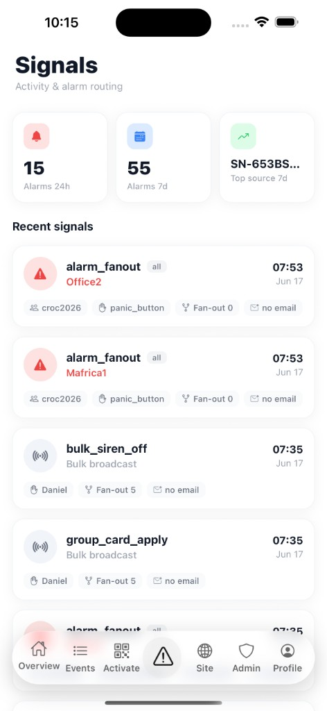
</p>

<p align="center"><sub>Home map · recent events · quick setup · live activity — on iPhone and Android.</sub></p>

The app is what most people use day to day:

- **Get the alert** — push notification plus a real phone call when it's urgent
- **See where and why** — map, photo, plain-language reason
- **Do your part** — accept a dispatch, mark arrived, mark resolved
- **Full record** — timeline of every event you've been part of

Tap a notification and you land straight on the right screen — the incident or your assigned job.

---

<h2 id="trust">Built For Trust</h2>

Safety software only works if you can trust it. So we built trust in from the start:

- **Alert first, think second.** Your phone knows within seconds. AI scoring never blocks the first notification.
- **The machine never overrules safety.** It can raise urgency, never quietly lower it.
- **People approve the big steps.** The AI prepares; a human decides.
- **Everything is written down.** A full, honest record of every event.
- **It keeps working even if the smart part is down.** Basic rules still ring the right phones.
- **Your data stays yours.** Each customer's information is kept separate.

---

<h2 id="highlights">What Makes It Different</h2>

In plain terms:

- **Seconds, not minutes** — alerts reach a phone within a few seconds.
- **A reason you can read** — every score comes with one plain sentence.
- **Never a dead end** — if one person misses it, the next is called automatically.
- **The right steps, every time** — response plans run the correct sequence for fire, SOS, or intrusion.
- **Nearest person, dispatched** — finds the closest suitable responder and routes them.
- **Team coordination for big events** — organises responders into clear roles on the fly.
- **Silent duress / SOS** — a coercion signal raises a quiet, high-priority alert an attacker can't cancel.
- **Doesn't give away its location** — a trigger can stay silent while quietly alerting nearby units.
- **Warns before things break** — spots weak batteries and failing devices early.
- **Get ready before it happens** — readiness score, certified plans, practice drills.
- **Prove it afterwards** — full timeline, proof bundle, post-incident review.
- **Sits on top, not in the way** — works alongside your existing cameras and alarms instead of replacing them.

---

<h2 id="roadmap">Roadmap — Honest Status</h2>

We label everything in three tiers — and never overclaim.

**✅ Live now** — running on real sites today
> Device alerts · phone calls · photos · live map · mobile apps · command center · incident list & detail · responder queue · audit log · separated data · encrypted backup

**🧪 Ready — turned on per site** — built and tested, switched on as we roll each site out
> AI urgency scoring · response plans · nearest-responder dispatch · team coordination for big events · silent duress / SOS · predictive maintenance · readiness score · practice drills · proof of response · post-incident review · **Dock drone assist (DJI Dock 3 + Matrice 4D / 4TD)** · city patrol divert

**🚧 In development — not open yet**
> Visual recognition (seeing what's in a photo) · more on-site robots · a version for homes and individuals · the wider Croc Nexus AI vision (see [Ecosystem](#ecosystem))

"Turned on per site" means a setting we enable for you — not a new project.

---

<h2 id="ecosystem">Ecosystem</h2>

Croc Sentinel is the first piece of a bigger idea from **Croc Nexus AI Technologies**: **AI that works like a reliable team member** — doing the routine thinking, staying visible so you can watch it, and always leaving the important decisions to you.

```text
Croc Nexus (the bigger vision)
   ├── Croc Sentinel        →  the full response system for your site   (trial)
   ├── Croc AI Orchestrator →  the engine that powers it                (trial)
   └── More AI helpers      →  everyday work, coming later            (not open yet)
```

Site safety is where our AI meets the real world first — the same "smart layer on top" approach is meant to help with far more over time.

---

<h2 id="faq">FAQ</h2>

**Does this replace my cameras, alarms, or recording system?**
No — that's the whole point. Sentinel is a **smart layer on top** of what you already have. Your equipment keeps doing its job; Sentinel adds the understanding, decision, and follow-through. We review what you have and agree the connection scope per project.

**Is this just an alarm?**
No. Detection is the easy part. Croc Sentinel runs the **full response** — before (readiness), during (coordinate), and after (proof). Ordinary alarms stop at the beep.

**Does this replace my security guards?**
No. People still respond on site. Sentinel just makes sure the right person knows fast, knows why, and every step is saved.

**What do I need at my site?**
A working internet connection (Wi‑Fi or wired), so alerts can travel and reach phones.

**Can it fit my specific building?**
Yes. We set the rules, urgency levels, response plans, and call list for your place.

**Is the AI making decisions on its own?**
It makes the *first* suggestion and handles the routine. Anything important waits for a human "yes."

**What happens if no one answers the call?**
It automatically escalates to the next contact — and keeps a record of every attempt.

**Do you support drones?**
Yes — we support **DJI Dock 3** with **Matrice 4D** (day) and **Matrice 4TD** (thermal / night). AI can suggest the nearest ready dock and a city-patrol divert; a person still approves before anything critical flies. See [Drones](#drones) and the [demo video](#watch).

**Can I get the source code or put my own brand on it?**
No. The app and the smart parts stay ours — no white-label, no rebranding. This page shares only a small demo and plain explanations.

**What does "early / trial" mean? Is it finished?**
We're honest in three tiers (see the [Roadmap](#roadmap)): core monitoring, alerts, calls, and apps are **live now**; AI response features and Dock drone assist are **built / supported and turned on per site**; visual recognition, more robots, and a home version are still **in development**. It's honest work in progress, not a finished mass-market product.

---

<h2 id="contact">Contact</h2>

**Croc Nexus AI Technologies** · Malaysia  
partnerships@crocnexus.com · +084-349525

---

<p align="center">
  <strong>Croc Nexus AI Technologies</strong><br/>
  Croc Sentinel · Croc AI Orchestrator<br/>
  <sub>© Croc Nexus AI Technologies · <a href="LICENSE">MIT License</a> (this repository's materials only)</sub>
</p>
