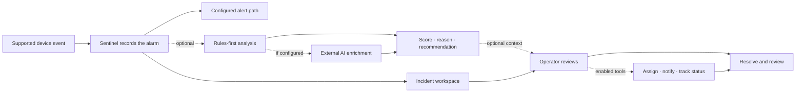

<p align="center">
  
</p>

<p align="center">
  
</p>

<p align="center"><sub>Concept hero illustration.</sub></p>

<h1 align="center">Croc Sentinel</h1>

<p align="center">
  <strong>A browser-based incident-response platform for site operators, with optional AI assistance.</strong><br/>
  <sub>Turn device alerts into clearer context, guided response, and reviewable records.</sub><br/>
  <sub>A trial-stage product from Croc Nexus AI Technologies · a two-person AI startup in Malaysia.</sub>
</p>

<p align="center">
  <a href="LICENSE"></a>
  
  
  
</p>

<p align="center">
  <a href="#what-it-is">What it is</a> ·
  <a href="#ai-collaboration">AI collaboration</a> ·
  <a href="#helps">What it helps</a> ·
  <a href="#difference">Why different</a> ·
  <a href="#incident-os">Incident OS</a> ·
  <a href="#what-exists">What exists</a> ·
  <a href="#incident-journey">Incident journey</a> ·
  <a href="#command-center">Command Center</a> ·
  <a href="#status">Status</a> ·
  <a href="#future-vision">Future vision</a> ·
  <a href="#faq">FAQ</a>
</p>

---

## What Croc Nexus builds

**Croc Nexus AI Technologies** is a Malaysia-based AI startup building two connected products:

- **Croc Sentinel** — the site-facing product for devices, alarms, incidents, operators, and response records.
- **Incident OS** — the response spine inside Sentinel: prepare → respond → prove.
- **Croc AI Orchestrator** — the private coordination direction behind optional event analysis and response workflows.

---

<h2 id="what-it-is">What is Croc Sentinel?</h2>

An alarm can tell someone that something happened. The harder work comes next:

- Which device or area is affected?
- What information does the operator need?
- Which response plan applies?
- What did people and systems do?
- What should be reviewed afterwards?

**Croc Sentinel brings these steps into one browser-based operations console.**

The current core receives supported device events, records alarms and incidents, shows them to authorized operators, runs configured alarm and notification paths, and keeps operational timelines and audit records.

It does not remove the need for trained people, site procedures, emergency services, or site-specific validation.

---

<h2 id="ai-collaboration">How Sentinel and AI collaborate</h2>

Croc Sentinel and Croc AI Orchestrator have different jobs:

- **Sentinel is the operational foundation.** It receives device events, records the alarm, applies configured alarm behavior, and gives operators a shared incident workspace.
- **Sentinel’s optional analysis runs rules first.** When enabled, it can produce a risk score, category, plain-language reason, and recommendation.
- **Croc AI Orchestrator can add optional enrichment.** When separately configured, it can enrich the human-readable summary and recommendation.
- **People remain responsible.** Operators review the context and use the response tools allowed for their role and site.
- **The system keeps the working record.** Available event, operator, dispatch, and audit activity can appear in the incident workspace, alongside a separate post-incident review.


```mermaid
flowchart LR
    A["Supported device event"] --> B["Sentinel records the alarm"]
    B --> C["Configured alert path"]
    B --> D["Incident workspace"]
    B -. "optional" .-> E["Rules-first analysis"]
    E -. "if configured" .-> F["External AI enrichment"]
    E --> G["Score · reason · recommendation"]
    F --> G
    G -. "optional context" .-> H["Operator reviews"]
    D --> H
    H -. "enabled tools" .-> I["Assign · notify · track status"]
    H --> J["Resolve and review"]
    I --> J
```

The important design choice is that **the alarm path does not wait for AI**. AI can help add context and recommendations, but it is not the alarm itself and does not replace the operator.

### Why we designed it this way

1. **Alert first** — optional analysis should not delay the basic alarm path.
2. **Rules before model output** — the baseline score remains visible and reviewable.
3. **Explain the recommendation** — operators need a reason, not only a number.
4. **Keep people in control** — permissions and configured approval remain part of high-impact actions.
5. **Use AI as a module** — a site can use the core without enabling every advanced capability.
6. **Support follow-up from the record** — timelines and reviews help teams identify lessons and actions.

---

<h2 id="helps">What the product can help with</h2>

Croc Sentinel is designed to help operators and site managers:

- **See the event in context** — device, area, history, available evidence, and related actions in one workspace.
- **Reduce ad-hoc decisions** — use versioned, internally reviewed response rules instead of relying only on memory.
- **Prioritize attention** — when optional analysis is enabled, add a risk score, reason, and recommendation.
- **Give teams one shared picture** — incidents, devices, timelines, and supported response status in one console.
- **Track supported response steps** — see assignments and status changes when optional dispatch is enabled.
- **Review what happened** — assemble available incident records and write a post-incident review.
- **Find preparation gaps** — use configuration-readiness checks before an incident.
- **Add capabilities gradually** — enable cameras, dispatch, voice, automation, or analysis only where the site is ready.

These are product goals and supported workflows, not promises of a specific response-time improvement or outcome at every site.

---

<h2 id="difference">How it differs from a basic alarm workflow</h2>

This comparison is with **basic alarm deployments**, not every security product on the market.

| Area | Basic alarm workflow | Croc Sentinel approach | Practical benefit |
|:-----|:---------------------|:-----------------------|:------------------|
| **Alert** | A siren or isolated notification | Alarm record plus a shared incident view | Provides the starting context in one view |
| **Context** | Operator may need to check separate systems | Device, history, available evidence, and timeline together | Puts related incident information together |
| **Decision support** | Interpretation may rely mainly on the operator | Optional rules-first score, reason, and recommendation | Gives the operator an additional prioritization signal |
| **Response plan** | Procedure may be verbal, on paper, or remembered | Versioned response rules marked as reviewed inside Sentinel | Supports a reviewable procedure between shifts |
| **Response tracking** | Calls and actions may be recorded separately | Optional assignment and status workflow | Provides a common view of supported response progress |
| **After the incident** | Logs may require manual reconstruction | Timeline, read-only incident summary, audit records, and review | Keeps available records together for operational review |
| **AI dependency** | Usually none | Core alarm still works without optional AI | AI can assist without becoming a single point of failure |
| **Human control** | Depends on local procedure | Roles, permissions, and workflow-specific approval gates where configured | Makes supported responsibilities and controls visible |
| **Expansion** | May be tied to one fixed workflow | Optional modules selected and validated for each deployment | Adopt modules according to the agreed scope |

### The main advantage

The goal is not simply to create a louder alarm or another AI label. It is to connect **detection, operator context, guided response, and reviewable records** while keeping AI optional and people accountable.

> **Availability today:** Croc Sentinel is a trial-stage, site-specific product, not a generally available turnkey service. Source review confirms that code paths exist; it does not confirm that every capability is enabled, release-ready, or field-validated. Each trial requires a written scope covering devices, notification channels, optional modules, and completed site tests.

---

<h2 id="incident-os">Incident OS — what we built</h2>

**Incident OS** is the product spine of Croc Sentinel. It is the system that turns a device alarm into a prepared, coordinated, and reviewable response.

### Concept

| Phase | Plain question | What was built |
|:------|:---------------|:---------------|
| **Before** | Are we ready? | Response plans, readiness checks, optional drills |
| **During** | Who goes, and what happens next? | Incident workspace, alerts, optional AI and dispatch |
| **After** | What really happened? | Timeline, response summary, post-incident review |

### Artifacts delivered

| Kind | What it contains |
|:-----|:-----------------|
| **Product plans** | Master plan for Before / During / After atoms, deployment order, release gates |
| **Reference matrices** | Glossary, capability matrix, console routes, API map, realtime ownership, screen matrix |
| **Backend domains** | Alarm/event spine, incident BFF, readiness, response plans, optional AI / dispatch / swarm / drills / actuators |
| **Console pages** | Overview, incidents, response, plans, readiness, drill, intelligence, orchestration, audit |
| **Contracts** | Focused API and UI wiring tests that prove the modules exist and stay consistent |

### Technical architecture (high level)

```text
Device alarm
    → record event + notify first
    → open shared incident workspace
    → optional rules-first analysis (+ optional Orchestrator enrichment)
    → optional assignment / status tracking
    → timeline + response summary + post-incident review
```

Design rules:

1. Alert first — optional AI must not block the basic alarm path.
2. Rules before model output — score and reason stay reviewable.
3. People stay in control — permissions and configured approval for high-impact steps.
4. Modules are attachable — a site can run the core without every advanced feature.
5. Disabled means unavailable — optional modules do not pretend to be live when off.

### Status in one line

- **Core Incident OS path** — built as the baseline response lifecycle.
- **Advanced modules** — built in source, mostly default-off, enabled per deployment after validation.
- **Full Advanced Live promotion** — not claimed; staging and field evidence remain incomplete.

Full detail: **[Incident OS documentation](docs/INCIDENT_OS.md)**

---

<h2 id="what-exists">What exists in the private product source</h2>

### Baseline source

The current private source includes:

- Device identification, registration, claiming, ownership, revocation, status, telemetry, and remote commands
- Alarm event records and grouped siren behavior
- A browser-based Command Center
- Incident lists, incident workspaces, and timelines
- Filterable event history and live event transports
- Configurable notification paths
- Response-plan import, versioning, and certification
- Readiness scoring and gap lists
- Audit records and CSV export
- Read-only response-record bundles
- Draft and submitted post-incident reviews
- Role, tenant, and device-ownership checks
- Firmware-update inventory, campaigns, device results, and rollback controls

Some functions still depend on deployment configuration, external providers, compatible equipment, and site testing. Source code alone does not prove that a capability is enabled or field-validated at a particular site.

> Inside Sentinel, “certified response plan” means that an authorized user marked a plan version as reviewed. It is not certification by a regulator, insurer, standards body, or independent assessor.

### Optional deployment source

The private source also contains optional modules for:

- Camera snapshots and evidence delivery
- Rules-first incident scoring with optional AI enrichment
- Responder phone locations and dispatch
- Voice calls
- Automation and scheduled actions
- SOS and duress workflows
- Advanced exports, backup workflows, and platform controls

Most of these modules are **disabled by default**. They require configuration, permissions, external services, and deployment-specific validation.

### Experimental or contract-only source

The repository also contains less-mature work, including:

- Side-effect-free drill simulation using non-production executors
- Device-health and predictive-maintenance experiments
- Experimental multi-responder coordination
- Generic future-resource contracts
- Mock drone and robot adapters with no live hardware control

---

<h2 id="incident-journey">Before, during, and after an incident</h2>

### Before — prepare

**Baseline source**

- Import, version, and certify response rules
- Review a readiness score and configuration gaps
- Check devices and notification recipients

**Optional source**

- Run isolated, side-effect-free practice simulations
- Review device-health and SOP suggestions

The readiness page is an advanced-profile configuration score. Its checks can include disabled optional modules, and some checks only confirm configuration flags. It is not proof that a site is operationally ready and is not an independent safety certification.

### During — see and respond

**Baseline source**

1. A supported device sends an event.
2. Sentinel records the event and applies configured alarm behavior.
3. Authorized users see the alarm or incident in the web console.
4. Operators review the device, event history, timeline, and available evidence.
5. Supported operator actions are recorded through the event and audit paths.

**Optional source**

- Rules-first risk scoring and recommendations
- Responder assignments and status transitions
- Consent-aware phone-location reporting
- Delayed voice calls to an assigned responder
- Commander controls and SLA views
- Experimental incident-cell and resource-cluster coordination

These optional workflows are not described as active at a site until they are enabled and validated there.

### After — review and learn

The source includes:

- An incident timeline assembled from available records
- A read-only response-record bundle
- Post-incident review drafts and submissions
- Root-cause, lessons-learned, and action-item fields
- Supported audit export paths

These are operational records from data processed by Sentinel. They are not cryptographic proof and do not promise legal, regulatory, insurance, or compliance acceptance.

---

<h2 id="command-center">Command Center</h2>

The Command Center is a browser-based operations console.

Its core views include:

- Devices and groups
- Alarms and incidents
- Incident details and timelines
- Readiness and response plans
- Activity and audit history
- Account and access settings
- Administrative tools for authorized roles

Depending on server configuration and permissions, optional views may include maps, camera snapshots, responder queues, AI analysis, automation, drills, health monitoring, orchestration, and voice settings.

Advanced pages are hidden or shown as unavailable when their server-side capability is disabled.

> We do not publish the current operations screenshot here because it contains internal names, device identifiers, tenant labels, and location information.

---

## Devices and alarms

The private product contains firmware and server components for supported Croc Sentinel devices.

The device and alarm core covers:

- Device identity and ownership
- Status and telemetry
- Authenticated server communication
- Alarm triggers
- Grouped siren behavior
- Command tracking
- Event and alarm records
- Remote software-update controls
- Role-based access to device functions

Camera snapshots are optional and disabled by default. Connections to third-party cameras, alarms, or recorders are assessed per project.

Croc Sentinel is **not** presented as plug-and-play with every existing security system.

---

## Notifications and calls

The backend includes configurable paths for email, Telegram, FCM push, and Twilio voice.

Actual delivery depends on:

- The channel being enabled
- Valid provider credentials
- Recipient configuration
- Provider and network availability
- Device-level and site-level testing

The source records call outcomes such as answered, busy, failed, or no-answer. This README does **not** claim a complete automatic “call the next contact” escalation chain.

---

<h2 id="ai-reality">Where AI fits — and where it does not</h2>

The core alarm path does **not** depend on AI.

An optional, default-off incident-analysis pipeline can produce:

- A rules-based risk score from 0 to 100
- A category
- A plain-language reason
- A recommended action
- Optional external AI enrichment when configured

If optional enrichment fails, the design can fall back to rules.

Important limits:

- AI incident handling is disabled by default.
- The current computer-vision module is a stub; no visual-recognition capability is claimed.
- A score or recommendation does not replace an operator.
- High-impact actions remain subject to permissions and configured approval.
- The public sample is fixed Python logic. It does not call an AI model.

---

## Responder dispatch and coordination

The private source contains a default-off responder workflow that can:

- Select a candidate from available, consented location records
- Create an assignment
- Send a configured push payload
- Track `pending → accepted → en route → on scene → resolved`
- Display personal and tenant-wide response queues

Current limitations:

- It is disabled by default.
- Candidate selection uses straight-line distance by default or as a fallback; an optional external route provider requires separate configuration.
- Location-freshness filtering is configurable and must be validated for each deployment.
- Phone permissions, fresh location data, backend configuration, and field testing are required.
- It is not claimed to dispatch the nearest responder automatically at every site.

Experimental, default-off incident-cell code can also form and rebalance resource clusters using capability, distance, health, and load signals. It is repository-level work, not a claim of a live automatic response team.

---

## Mobile and PWA

Croc Sentinel includes a responsive, installable web application, also called a **Progressive Web App (PWA)**.

The audited source contains:

- A web application manifest
- A service worker for the static interface shell
- Web deep-link handling
- Server-side contracts that can create alarm and responder push payloads

API and authentication responses are not intentionally cached by the service worker.

This repository does **not** prove an end-to-end web-push flow or a native iPhone or Android application. No native mobile source repository was available in the audited code. Notification receipt, notification-tap navigation, background location, and long-running phone behavior require separate device testing.

---

## Privacy, security, and human control

The current source includes named controls such as:

- Tenant and device-ownership boundaries
- Role-based access
- Scoped access to incidents and devices
- CSRF protection and login lockout controls
- Signed device-event and command paths
- Security checks around sensitive operations
- Audit events for supported workflows
- Human approval gates for selected advanced actions
- Fail-closed or degraded paths for several optional dependencies
- Encrypted manual backup export/import paths

We do not claim that:

- Every action is always captured without exception
- Audit records are cryptographically tamper-evident
- The product has a public compliance certification
- The repository proves the security of a production deployment

Every deployment still requires secure configuration, access review, backup planning, compatible equipment, and site-specific validation.

---

## Data and third-party services

Cloud-connected operation requires supported device and incident data to reach the configured Sentinel server.

Optional modules may also process:

- Camera snapshots, when a compatible camera workflow is enabled
- Responder location, when the user has consented and the location workflow is enabled
- Notification content sent through configured email, messaging, push, or phone providers
- Selected event context sent to an external AI service, only when optional enrichment is enabled

Hosting location, retention periods, deletion rules, subprocessors, backup destinations, and external-AI payloads are deployment and contract decisions. This public repository does not claim one universal policy for every site.

---

<h2 id="status">Honest status labels</h2>

We use four labels:

### 1. Baseline source

Present in the current private product source as a baseline workflow. This still does not mean a customer deployment is configured or field-validated.

Examples: device management, alarm records, incident views, timelines, response plans, readiness checks, audit records, response-record assembly, and post-incident reviews.

### 2. Optional deployment integration

Implemented but disabled by default, provider-dependent, role-gated, or requiring site validation.

Examples: AI analysis, cameras, responder dispatch, phone locations, voice calls, automation, and advanced exports.

### 3. Experimental or contract-only

A dry-run, experiment, contract, safety boundary, or placeholder exists, but maturity or operational integration is incomplete.

Examples: simulation executors, predictive-maintenance experiments, multi-responder coordination, generic future actuator resources, and mock drone or robot adapters.

### 4. Future

Not available today.

Examples: production computer vision, real drone or robot control, native mobile releases verified from this repository, broader third-party integrations, and personal/home use.

Passing repository tests does not by itself mean a feature is deployed, field-proven, or release-ready. Current advanced release, staging, security, performance, mobile-field, and soak evidence remains incomplete.

---

## No production drone integration today

Croc Sentinel does **not** currently integrate with DJI Dock, Matrice aircraft, or another production drone system.

The private source contains a generic future-resource interface and mock drone/robot adapters. The mock adapter does not control hardware, stream live aircraft video, plan city patrols, perform return-to-home, land in a dock, or report charging telemetry.

DJI Dock 3 and Matrice 4D/4TD are possible future integration targets only. No compatibility or delivery promise is made.

---

<h2 id="future-vision">Future vision and concept design</h2>

Future plans remain important to Croc Nexus. We publish them separately from current capabilities so readers can see the direction without mistaking it for a finished product.

### Drone-response concept

<p align="center">
  <a href="assets/video/sentinel-future-drone-concept.mp4">
    
  </a>
</p>

<p align="center">
  <a href="assets/video/sentinel-future-drone-concept.mp4"><strong>▶ Watch the future drone-response concept</strong></a>
  &nbsp;·&nbsp;
  <a href="assets/video/sentinel-future-drone-concept.gif">GIF preview</a>
</p>

> **Concept simulation — no current drone integration.** The film uses generated backgrounds and animated interface elements. It is not connected to DJI hardware, live video, flight telemetry, or a production deployment.

The concept explores a possible future workflow:

1. An incident appears in the Command Center.
2. Optional analysis suggests whether an aerial check may help.
3. An authorized person reviews and approves the proposed mission.
4. A future dock integration could launch a compatible aircraft.
5. A map could show the approved route and mission state.
6. Live video and telemetry could return to the Command Center.
7. Voice summaries could inform authorized responders.
8. The aircraft could return, land, and charge under the hardware vendor’s safety controls.
9. Mission records could be linked to the incident timeline.

Possible evaluation targets include **DJI Dock 3**, **Matrice 4D**, and **Matrice 4TD**. These names identify research targets, not supported products.

Before this could become a product capability, Croc Nexus would need:

- Approved vendor APIs, SDKs, accounts, and licensing
- A real hardware adapter rather than the current mock
- Flight-permission and local regulatory review
- Human approval, mission cancellation, and emergency-stop controls
- Route, weather, geofence, battery, link-loss, and return-to-home safeguards
- Authenticated telemetry and video transport
- Hardware-in-the-loop, failure, recovery, and field tests
- Clear data-retention, privacy, and operator-responsibility rules

### Wider Croc Nexus direction

Other future concepts include:

- AI agents with narrow, visible responsibilities
- Digital employee teams for non-safety operational work
- A controllable visual panel for watching and approving AI actions
- Token relay for model routing, metering, and policy
- More security devices and selected embodied systems
- Personal and home use

These are product directions, not current availability or delivery promises.

See [Vision and concepts](docs/VISION_AND_CONCEPTS.md) for the staged plan.

---

## Where it may fit

Croc Sentinel may be relevant to managed sites such as:

- Commercial buildings
- Campuses
- Clinics
- Industrial locations
- Public facilities
- Managed residential sites

Suitability depends on the site's equipment, network, response team, procedures, and local requirements. Integration scope is reviewed per project.

A working network connection is required for cloud-connected operation.

---

## Public sample

Run the small fictional scoring sample:

```bash
git clone https://github.com/DD-111/CROC-AI-SYSTEMS.git
cd CROC-AI-SYSTEMS
python -m src.croc_orchestrator.demo_assess samples/orchestrator/alarm_event.json
```

Python 3.11 or newer is required.

The sample applies fixed Python rules to fictional data. It is:

- Not an AI model
- Not the production Orchestrator
- Not connected to customer data
- Not a release of the private platform

---

<h2 id="faq">FAQ</h2>

### Does Sentinel replace existing cameras or alarms?

Not automatically. Sentinel is intended to work with supported Croc devices and selected integrations. Compatibility and scope are reviewed per project.

### Is Sentinel fully autonomous?

No. People remain responsible for response decisions and on-site action. Optional analysis can assist an operator but does not remove human responsibility.

### Does AI have to be available for an alarm to work?

No. The core alarm path is designed not to depend on optional AI analysis.

### Does Sentinel automatically call the next person if nobody answers?

Not as a generally available capability today. Voice and delayed-call components exist, but this README does not claim a completed automatic contact-list escalation chain.

### Is nearest-responder dispatch available?

The source contains an optional dispatch module. It is disabled by default and depends on location consent, current phone data, configuration, permissions, and site validation.

### Is there an iPhone or Android app?

The audited product includes a mobile-friendly PWA. No native iOS or Android source repository was available for verification.

### Do you support DJI drones?

No production DJI integration is available. The current drone code is a stub for a possible future interface.

### Is computer vision available?

No production computer-vision capability is claimed. The current vision module is a stub.

### Are all optional modules production-ready?

No. Some have code and focused tests but remain disabled by default, staging-gated, field-unverified, or experimental.

### Is the production source public?

No. This repository contains public documentation, fictional data, and small samples only. See the license for its exact scope.

---

## Contact

**Croc Nexus AI Technologies**<br/>
Malaysia<br/>
partnerships@crocnexus.com

---

<p align="center">
  <strong>Croc Nexus AI Technologies</strong><br/>
  Croc Sentinel · Croc AI Orchestrator<br/>
  <sub>© Croc Nexus AI Technologies · <a href="LICENSE">MIT License</a> for this repository's materials only</sub>
</p>
